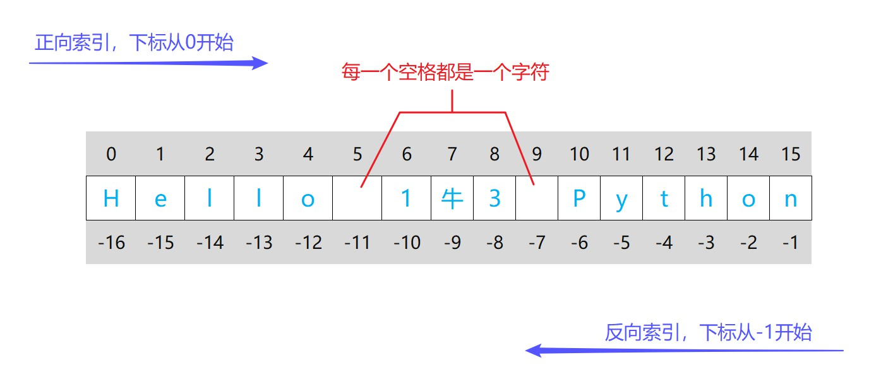

# 六种标准数据

## 数字（Number）

- 特性：不可变，不是序列
- 分类：整数、浮点数、布尔型、复数

整数（int）

- 包括正整数，负整数和零，如：789，-789，0

浮点数（float）

- 和数学中的小数类似，如：7.89，8.0
- 科学记数法认定为浮点数，如：3e4，3E4

布尔型（bool）

- 布尔型只有两个，分别是关键字True和False，它们被当成数字时，大小分别为1和0

复数（complex）

- 实部+虚部，表示为 a+bj 或 a+bJ，例如：3+4j，3+4J


type(object)

- 返回object的类型。

```python
num1 = 789
num2 = 3.14
num3 = True
num4 = 3+4j
string = 'hello'
print(type(num1))
print(type(num2))
print(type(num3))
print(type(num4))
print(type(string))
```

int([x])

- x：接收数字或特定字符串
- 将x转换为整数并返回，如果没有给x指定值，则返回0

```python
print(int())  # 0
print(int(3))  # 3
print(int(-3))  # -3
print(int(0))  # 0
print(int(3.99))  # 3
print(int(-3.99))  # -3
print(int(0.0))  # 0
print(int(True))  # 1
print(int(False))  # 0
print(int('12'))  # 12
print(int('-12'))  # -12

# 如果传的是字符串, 必须是整数形式的
int('12.1')  # ValueError
```


float([x])

- x：接收数字或特定字符串
- 将x转换为浮点数并返回，如果没有给x指定值，则返回0.0

```python
print(float())  # 0.0
print(float(3))  # 3.0
print(float(-3))  # -3.0
print(float(0))  # 0.0
print(float(3.99))  # 3.99
print(float(-3.99))  # -3.99
print(float(0.0))  # 0.0
print(float(True))  # 1.0
print(float(False))  # 0.0
print(float('12'))  # 12.0
print(float('-12'))  # -12.0
print(float('12.1'))  # 12.1
```

bool([x]) 

- 根据x指定的值，返回布尔值
- 如果没有给x指定值，则返回False

```python
"""
数字0, 0.0, 0j, False,
空字符串, 空列表, 空元组,
空字典, 空集合, None
...
以上这些数据bool判定为False,
其它数据通常判定为True
"""
print(bool())
print(bool(0))
print(bool(0.0))
print(bool(0j))
print(bool(False))
print(bool(''))
print(bool([]))
print(bool(()))
print(bool({}))
print(bool(set()))
print(bool(None))
print(bool('0'))  # True
print(bool(' '))  # True
print(bool('None'))  # True
print(bool('False'))  # True
print(bool('[]'))  # True
```

complex(real=0, imag=0)

- 创建一个 real + imag*1j 的复数并返回
- 如果第一个参数是字符串，它将被解释为复数，此时不能传第二个参数
- 如果没有传实参，则返回0j

```python
print(complex())  # 0j
print(complex(3.2, 4))  # (3.2+4j)
print(complex(3.2))  # (3.2+0j)
print(complex('3.2'))  # (3.2+0j)
print(complex("3.2+4j"))  # (3.2+4j)
```


## 字符串（String）

- 特性：不可变，是序列
- 单行字符串：用一对引号定义
- 多行字符串：用成对的三个引号定义

```python
empty_str = ''  # 空字符串
print(empty_str)

space_str = ' '  # 空格字符
print(space_str)

str1 = 'hello world'
print(str1)

str2 = "hello world"
print(str2)

str3 = '''hello world'''
print(str3)

str4 = """hello world"""
print(str4)

str5 = '''hello
world
，,：:！!
123
🐕🐬🐛'''
print(str5)

str6 = """hello
world
，,：:！!
123
🐕🐬🐛"""
print(str6)
```

str(object='')

- 将object转化为字符串形式并返回。

```python
print(str())  # ''
print(str('hello'))  # 'hello'
print(str(1234))  # '1234'
print(str(-1.23))  # '-1.23'
print(str(True))  # 'True'
print(str(3+4J))  # '(3+4j)'
```


**转义字符**

在字符串中，反斜杠和某些字符组成的特殊序列叫做转义字符。

| 转义字符 | 描述       |
| -------- | ---------- |
| \\\\     | 一个反斜杠 |
| \\'      | 一个单引号 |
| \\"      | 一个双引号 |
| \n       | 换行符     |
| \t       | 横向制表符 |


**原始字符串**

给字符串添加前缀r或R来声明，原始字符串中的反斜杠保留原样，不再触发转义行为。

注意：字符串末尾不能存在奇数个反斜杠，会引发语法错误。

```python
print('https:\\www.example.com\nuxy\tngj')
print(r'https:\\www.example.com\nuxy\tngj')
```


**字符串格式化**

① %格式化

格式化符号：

| 符号   | 描述                                                 |
| ------ | ---------------------------------------------------- |
| %s     | 格式化为字符串，适用于任何对象                       |
| %d、%i | 格式化为整数，仅适用于数字                           |
| %f、%F | 格式化为浮点数，默认精确到小数点后六位，仅适用于数字 |

```python
print('它叫%s, 我养了它%d年, 它每天睡%f小时!' % ('旺财', 2.8, 8.547))

# %.nf表示精确到小数点后n位
print('它叫%s, 我养了它%d年, 它每天睡%.2f小时!' % ('旺财', 2.8, 8.547))
```

② format方法格式化

```python
name = '旺财'
year = 2.8
hour = 8.547

# 传位置参数, 实参按照从左往右的顺序传入占位符{}
print('它叫{}, 我养了它{}年, 它每天睡{}小时!'.format(name, year, hour))

# 传关键字参数
print('它叫{n}, 我养了它{y}年, 它每天睡{h}小时!'.format(y=year, h=hour, n=name))

# 根据实参的下标传参
print('它叫{2}, 我养了它{0}年, 它每天睡{1}小时!'.format(year, hour, name))

# {:.nf}表示精确到小数点后n位
print('它叫{}, 我养了它{}年, 它每天睡{:.2f}小时!'.format(name, year, hour))
```

③ f-string格式化

```python
name = '旺财'
year = 2.8
hour = 8.547

print(f'它叫{name}, 我养了它{year}年, 它每天睡{hour}小时!')

# {:.nf} 表示精确到小数点后n位
print(f'它叫{name}, 我养了它{year}年, 它每天睡{hour:.2f}小时!')
```


**字符串方法**

str.replace(old, new, count=-1)

- old：旧字符串
- new：新字符串
- count：要替换的最大次数，默认不限制
-  用新字符串替换旧字符串并返回

```python
s = "Line1 Line2 Line4"

# 用 "b" 替换所有的 "Li"
print(s.replace("Li", "b"))

# 用 "b" 替换 "Li" 最多2次
print(s.replace("Li", "b", 2))
```

str.strip([chars]) 

- chars：指定要移除的字符，如果没有指定，则默认移除空白符（空格符、换行符、制表符）
- 删除字符串左右两边指定的字符

```python
# 删除字符串两边的空白符
str1 = ' \thello wrold h \n'
print(str1.strip())

# 删除字符串两边的'o'字符
str2 = "ooho hello wrold"
print(str2.strip('o'))

# 删除字符串两边的'c','w','o','m'字符
str3 = 'www.example.com'
print(str3.strip("cwom"))
```

str.startswith(prefix[, start[, end]])

- prefix：匹配的前缀，可以是字符串或者字符串组成的元组（元组中只要一个元素满足即可） 
- start：开始索引，不指定则默认为0
- end：结束索引（开区间），不指定则默认为 len(str)
- 判定字符串是否以 prefix 指定的值开始（start和end参数用来控制字符串的判定区间）

```python
str1 = "hello world"
print(str1.startswith("h"))
print(str1.startswith("he"))
print(str1.startswith("wo"))
print(str1.startswith("wo", 6))
print(str1.startswith(("wo", "h")))
```

str.endswith(suffix[, start[, end]])

- suffix：匹配的后缀，可以是字符串或者字符串组成的元组（元组中只要一个元素满足即可） 
- start：开始索引，不指定则默认为0
- end：结束索引（不包括该索引），不指定则默认为 len(str)
- 判定字符串是否以 suffix 指定的值结束（start和end参数用来控制字符串的判定区间）

```python
str1 = "hello world"
print(str1.endswith("d"))
print(str1.endswith("ld"))
print(str1.endswith("lo"))
print(str1.endswith("lo", 1, 5))
print(str1.endswith(("d", "lo")))
```

str.isdigit()

- 判定字符串中的每个字符是否都为数字型的字符

```python
string = '1234'
print(string.isdigit())  # True

string = '-123'
print(string.isdigit())  # False

string = '1.23'
print(string.isdigit())  # False
```

str.split(sep=None, maxsplit=-1)

- sep：分隔符,  不指定时默认为所有的空白符（空格、换行、制表符）, 并丢弃结果中的空字符串
- maxsplit：最大分隔次数，默认不限制
- 通过指定的分隔符对字符串进行分割，以列表的形式返回

```python
s = " Line1  \nLine2   \tLine3"

print(s.split('Li'))
print(s.split('Li', 2))
print(s.split(' '))
print(s.split())
```

str.join(iterable)

- iterable：包括str、list、tuple、dict、set等
- 将可迭代对象中的元素（元素必须是字符串）以指定的字符串连接，返回新的字符串

```python
s = '-.'

s1 = 'hello world'
print(s.join(s1))

s2 = ['1', '2', '3', '4']
print(s.join(s2))

s3 = ('1', '2', '3', '4')
print(s.join(s3))

# 字典作为iterable, 只有键参与迭代
s4 = {'height': 175, 'weight': 65}
print(s.join(s4))

s5 = {'5', 'hello', '789', 'world'}
print(s.join(s5))
```

str.count(sub, [start[, end])

- sub：需要查找的字符串
- start：开始索引，默认为0
- end：结束索引（开区间），默认为 len(str)
- 返回 sub 在字符串中出现的次数

```python
s = "hello world"
print(s.count('l'))  # 3
print(s.count('lo'))  # 1
print(s.count('ol'))  # 0
```

str.find(sub[, start[, end]])
返回从左边开始第一次找到指定字符串时的正向索引，找不到就返回 -1

str.rfind(sub[, start[, end]])
返回从右边开始第一次找到指定字符串时的正向索引，找不到就返回 -1

str.index(sub[, start[, end]])
类似于find()，唯一不同在于，找不到就会报错

str.rindex(sub[, start[, end]])
类似于rfind()，唯一不同在于，找不到就会报错

- sub：需要查找的字符串
- start：开始索引，默认为0
- end：结束索引（开区间），默认为 len(str)

```python
s = 'hello world'

print(s.find('l'))
print(s.rfind('l'))
print(s.find('lo'))
print(s.rfind('lo'))

print(s.index('l'))
print(s.rindex('l'))
print(s.index('lo'))
print(s.rindex('lo'))

print(s.find('ol'))  # -1
print(s.rfind('ol'))  # -1
```

str.capitalize()
将字符串的首字母变成大写，其他字母变小写，并返回

str.title()
将字符串中所有单词的首字母变成大写，其他字母变小写，并返回

str.upper()
将字符串中所有字符变成大写，并返回

str.lower()
将字符串中所有字符变成小写，并返回

str.swapcase()
将字符串中所有大写字符变成小写，小写变成大写，并返回

```python
s = '你好hELlo wo?rLD世界TuP'
print(s.capitalize())
print(s.title())
print(s.upper())
print(s.lower())
print(s.swapcase())
```


## 列表（List）

- 特性：可变，是序列
- 列表用方括号定义，元素没有类型限制

```python
lst1 = []
lst2 = [567]
lst3 = [567, 'hello', 3+4j]
```

**修改列表**

列表是可变的，可以通过索引和切片的方式来对列表的元素重新赋值

```python
lst = [567, 'hello', 78.9, 'world', False]

"""
针对一个元素:
格式:  lst[index] = object
"""
lst[2] = 9.87
lst[3] = 'dlrow'
print(lst)

"""
针对多个元素:
格式:  lst[start: end: step] = iterable
"""
# 1 vs 1
lst[2:3] = [9.87]

# n vs n
lst[2:4] = [9.87, 'dlrow']

# step为1, 可以 1 vs n
lst[2:3] = [7, 8, 9]

# step为1, 可以 n vs m
lst[2:4] = [1, 2, 3]
lst[1:4] = [1, 2]

# step为1, 可以 1 vs 0
lst[2:3] = []

# step为1, 可以 n vs 0
lst[1:4] = []

# step不为1, 只能 n vs n
lst[1::2] = ['a', 'b']

# 插入一个元素
lst[0:0] = ['a']
lst[1:1] = ['b']
lst[len(lst):] = ['c']

# 插入多个元素
lst[0:0] = ['a', 'b', 'c']
lst[1:1] = ['d', 'f']
lst[len(lst):] = ['x', 'y', 'z']
print(lst)
```

list([iterable])

- 将一个iterable对象转化为列表并返回，如果没有传实参，则返回空列表

```python
print(list())
print(list("hello"))
print(list((1, 2, 3)))

# 字典作为一个iterable, 只有键参与迭代
print(list({1: 2, 3: 4}))
print(list({'a', 'b', 'c', 789, 456}))
```


**列表方法**

list.append(object)

- 往列表中追加一个元素，无返回值，相当于 lst[len(lst):] = [object] 

```python
lst = [1, 2, 3]

lst.append(4)
print(lst)

lst.append([5, 6])
print(lst)
```

list.extend(iterable)

- 使用 iterable 中的所有元素来扩展列表，无返回值，相当于 lst[len(lst):] = iterable

```python
lst = [1, 2, 3]

lst.extend([5, 6])
print(lst)
```

list.insert(index, object)

- index：要插入元素的位置
- object：要插入的元素
- 在指定位置插入一个元素，无返回值

```python
lst = [1, 2, 3, 4]
lst.insert(1, ['a', 'b'])
print(lst)
```

list.sort([key], reverse=False)

- key：必须指定一个可调用对象（比如：函数，类）
- reverse：默认为False，代表升序，指定为True，则为降序
- 对原列表进行排序，无返回值

```python
lst = [1, 2, -5, -3]
# 升序排序
lst.sort()
print(lst)

lst = [1, 2, -5, -3]
# 降序排序
lst.sort(reverse=True)
print(lst)

# chr(i) 返回Unicode码位为指定整数的字符
# ord(c) 返回指定字符对应的Unicode码位
print(chr(97))  # 'a'
print(ord('a'))  # 97

# 字符串在大小比较时是逐个字符进行比较的
# 根据字符在编码表里的位置
lst = ['10', '2', '1', '-3', '101']
lst.sort()
print(lst)

# abs(number) 内置函数，返回number的绝对值
print(abs(9))  # 9
print(abs(9.87))  # 9.87
print(abs(0))  # 0
print(abs(-9))  # 9
print(abs(-9.87))  # 9.87
print(abs(True))  # 1
print(abs(False))  # 0
print(abs(3+4j))  # 求模, 5.0

"""
对lst中的元素按照绝对值的大小降序排序

把lst中的每个元素依次作为实参传递给key所指定的函数去调用, 即:
abs(1), abs(2), abs(-5), abs(-3)
返回值分别为: 1, 2, 5, 3
根据返回值的大小对原数据进行排序
"""
lst = [1, 2, -5, -3]
lst.sort(key=abs, reverse=True)
print(lst)

"""
对lst中的元素按照数字的大小升序排序

把lst中的每个元素依次作为实参传递给key所指定的类去调用, 即:
int('10'), int('2'), int('1'), int('-3'), int('101')
返回值分别为: 10, 2, 1, -3, 101
根据返回值的大小对原数据进行排序
"""
lst = ['10', '2', '1', '-3', '101']
lst.sort(key=int)
print(lst)
```

sorted(iterable, [key], reverse=False)

- iterable：要排序的可迭代对象
- key：指定一个函数，在排序之前，每个元素都先应用这个函数之后再排序
- reverse：默认为 False，代表升序，指定为 True 则为降序
- 对可迭代对象进行排序，以列表形式返回排序之后的结果

```python
lst = [1, 2, -5, -3]

# 升序排序
print(sorted(lst))

# 降序排序
print(sorted(lst, reverse=True))

# 对lst中的元素按照绝对值的大小降序排序
print(sorted(lst, key=abs, reverse=True))

# 对字符串排序
print(sorted('hello world'))
```

list.reverse()

- 把列表中的元素倒过来，无返回值

```python
lst = [1, 3, 5, 2]
lst.reverse()  # inplace
print(lst)

lst = [1, 3, 5, 2]
print(lst[::-1])  # copy
```

list.count(x)

- 返回元素 x 在列表中出现的次数

```python
lst = [1, 3, 2, '23', [2, 4]]
print(lst.count(2))  # 1
```

list.index(x[, start[, end]])

- x：要找的值
- start：起始索引，默认为 0
- end：结束索引（开区间），默认为 len(lst)
- 返回从左边开始第一次找到指定值时的正向索引，找不到报错

```python
lst = [1, 2, 3, 2, '23', [2, 4]]
print(lst.index(2))  # 1

lst.index(4)  # Error
```

list.pop(i=-1)

- i：要删除并返回的元素的索引
- 删除列表中指定索引的元素并返回该元素，默认最后一个
- 索引超出范围，则报错

```python
lst = [567, 'hello', True, False, 456]
print(lst.pop(1))  # 'hello'
print(lst)  # [567, True, False, 456]
```

list.remove(x)

- 删除列表中从左往右遇到的第一个x元素，无返回值
- 如果没有这样的元素，则报错

```python
lst = [1, 2, 4, 2, 3, 3]

lst.remove(2)
lst.remove(2)
print(lst)
```

list.copy()

- 返回该列表的一个副本，等价于 lst[:]

```python
lst = [567, 'hello', True, False, 456]
new_lst = lst.copy()
print(new_lst)
```

list.clear()

- 移除列表中的所有元素，无返回值，等价于 del lst[:]

```python
lst = [567, 'hello', True, False, 456]
lst.clear()
print(lst)  # []
```

Python中的删除操作通常不是直接删除内存中的数据，而是解除引用关系，当数据的引用计数为0时，该数据就变为了一个可回收的对象，然后会被Python自动回收。

```python
lst1 = [567, 'hello', 456, [912, 923], 'world']
lst2 = lst1

del lst1
print(lst2)

del lst2[1]
print(lst2)

del lst2[0], lst2[2]
print(lst2)

del lst2[:3:2]
print(lst2)

del lst2[3][0]
print(lst2)

del lst2[:]
print(lst2)
```


## 元组（Tuple）

- 特性：不可变，是序列
- 元组用圆括号定义，元素没有类型限制

```python
# 空元组
tup = ()

# 元组中只有一个元素时, 逗号不能省略
tup = (789,)

# 封包
tup = 'China', 1997, 2000

tup = ('China', 1997, 2000)
```

```python
# 元组是不可变的, 但其中的可变成员仍然可以被改变
tup = (456, 'hello', ([789, 'world'],))
tup[-1][0][0] = 987
print(tup)
```

tuple([iterable])

- 将一个iterable对象转化为元组并返回，如果没有实参，则返回空元组

```python
print(tuple())
print(tuple("hello"))
print(tuple([1, 2, 3]))

# 字典作为一个iterable, 只有键参与迭代
print(tuple({1: 2, 3: 4}))
print(tuple({'a', 'b', 'c', 789, 456}))
```


**元组方法**

tuple.count(x)

- 返回元素 x 在元组中出现的次数

```python
tup = (1, 3, 2, '23', [2, 4])
print(tup.count(2))  # 1
```

tuple.index(x[, start[, end]])

- x：要找的值
- start：起始索引，默认为 0
- end：结束索引（开区间），默认为 len(tup)
- 返回从左边开始第一次找到指定值时的正向索引，找不到报错

```python
tup = (1, 2, 3, 2, '23', [2, 4])
print(tup.index(2))  # 1

print(tup.index(4))  # Error
```


## 字典（Dictionary）

- 特性：可变，不是序列
- 字典用花括号定义，每个元素都是键值对的形式 key: value
- 字典的键不能存在可变的数据；值没有限制。
- 字典的键如果重复，会自动去重，保留第一个重复键，并且其它重复的键对应的值还会对第一个重复键对应的值进行修改；值可以重复。
- 当字典作为一个iterable对象参与操作时，只有键参与迭代。


**创建字典的多种方式**

① 直接在空字典里面写键值对

```python
d = {'name': 'Tom', 'age': 28}
print(d)
```

② 定义一个空字典，再往里面添加键值对

```python
d = {}
d['name'] = 'Tom'
d['age'] = 28
print(d)
```

③ 把键值对作为关键字参数传入

```python
d = dict(name='Tom', age=28)
print(d)
```

④ 用可迭代对象来构建字典

```python
d = dict([('name', 'Tom'), ('age', 28)])
print(d)
```

⑤ 用映射结构来构建字典

```python
d = dict(zip(['name', 'age'], ['Tom', 28]))
print(d)
```

dict(\*\*kwargs)  /  dict(mapping)   /  dict(iterable)

- 用于创建一个字典并返回

```python
print(dict())
print(dict(one=1, two=2, three=3))

print(dict(zip(['one', 'two', 'three'], [1, 2, 3])))

print(dict([('one', 1), ('two', 2), ('three', 3)]))
```

zip(*iterables)

- 返回一个迭代器，在迭代操作时，其中的第 i 个元组包含来自每个可迭代对象的第 i 个元素
- 当所输入可迭代对象中最短的一个被耗尽时，迭代器将停止迭代
- 不带参数时，它将返回一个空迭代器

```python
# 迭代器一定是iterable
# 迭代器如果耗尽, 则无法继续迭代
res = zip('abcd', [4, 5, 7, 1])
print(list(res))
print(tuple(res))  # ()

res = zip('abcd', [4, 5, 7])
print(tuple(res))

res = zip('abcd', [4, 5, 7])
# next(iterator) 内置函数, 返回迭代器的下一个元素
print(next(res))
print(next(res))
print(next(res))

res = zip('abcd')
print(list(res))

res = zip()
print(list(res))
```


**访问和修改字典**

访问字典的值

```python
d = {'Name': 'Tom', 'Age': 7, 'Class': 'First'}

print(d['Name'])
print(d['Age'])
# 如果指定的键不存在, 则报错
d['Gender']  # Error
```

修改字典

```python
d = {'Name': 'Tom', 'Age': 7, 'Class': 'First'}

# 修改指定键所对应的值
d['Name'] = 'Tony'
d['Age'] = 8
print(d)

# 如果指定的键不存在, 则新增该键值对
d['Gender'] = 'male'
print(d)

# 删除字典的元素
del d['Age'], d['Name']
print(d)
```


**字典方法**

dict.keys()

- 返回由字典所有键组成的一个新视图
- 返回的对象是视图对象，这意味着当原字典改变时，视图也会相应改变

```python
d = {'name': 'Tom', 'age': 15, 'height': 162}
view_keys = d.keys()
print(view_keys)

# 修改字典
d['weight'] = 59

print(view_keys)
```

dict.values()

- 返回由字典所有值组成的一个新视图
- 返回的对象是视图对象，这意味着当字典改变时，视图也会相应改变

```python
d = {'name': 'Tom', 'age': 15, 'height': 162}
view_values = d.values()
print(view_values)

# 修改字典
d['weight'] = 59

print(view_values)
```

dict.items()

- 返回由字典所有键和值组成的一个新视图
- 返回的对象是视图对象，这意味着当字典改变时，视图也会相应改变

```python
d = {'name': 'Tom', 'age': 15, 'height': 162}
view_items = d.items()
print(view_items)

# 修改字典
d['weight'] = 59

print(view_items)
```

dict.get(key, default=None)

- key：键
- default：如果指定的键不存在时，返回该值，默认为 None
- 返回指定的键对应的值，如果 key 不在字典中，则返回 default

```python
d = {'name': 'Tom', 'age': 15, 'height': 162}
print(d.get('age'))
print(d.get('weight'))
print(d.get('weight', '该键不存在'))
```

dict.update([other])

- 用 other 来更新原字典，没有返回值
- other 可以像 dict() 那样传参

```python
d = {'name': 'Tom', 'age': 15, 'height': 162}
d.update(age=18, weight=59)
d.update({'age': 18, 'weight': 59})
d.update(zip(['age', 'weight'], [18, 59]))
d.update([('age', 18), ('weight', 59)])
print(d)
```

dict.pop(key[, default])

- key：键
- default：指定当键不存在时应该返回的值
- 移除 key 所对应的键值对，并返回 key 对应的值；如果 key 不在字典中，则返回 default 指定的值，此时如果 default 未指定值，则报错

```python
d = {'name': 'Tom', 'age': 15, 'height': 162}
print(d.pop('height'))
print(d)

print(d.pop('weight', None))
```

dict.popitem()

- 从字典中移除最后一个键值对，并返回它们构成的元组 (key, value) 

```python
d = {'name': 'Tom', 'age': 15, 'height': 162}
print(d.popitem())
print(d)
```

dict.setdefault(key, default=None)

- 如果字典存在指定的键，则返回它的值
- 如果不存在，则返回 default 指定的值，并且新增该键值对

```python
d = {'name': 'Tom', 'age': 15, 'height': 162}
print(d.setdefault('age'))

print(d.setdefault('weight'))
print(d)

print(d.setdefault('gender', 'male'))
print(d)
```

dict.copy()

- 返回该字典的一个副本

```python
d = {'name': 'Tom', 'age': 15, 'height': 162}
new_d = d.copy()
print(new_d)
```

dict.clear()

- 移除字典中的所有元素，无返回值

```python
d = {'name': 'Tom', 'age': 15, 'height': 162}
d.clear()
print(d)
```


## 集合（Set）

- 特性：可变，不是序列
- 集合也用花括号定义，但其中的元素不是键值对的形式
- 集合中不能存在可变的数据
- 集合是无序的
- 集合的元素如果重复，会自动去重，保留一个重复项
- 创建空集合只能用 set()，因为 {} 已用来创建空字典了

```python
# 空集合
s = set()
print(s)

# 空字典
d = {}
print(d)

s = {789, 456, "hello", (135,), 'world'}
print(s)
```

set([iterable])

- 将一个iterable对象转化为集合并返回，如果没有实参，则返回空集合

```python
print(set())
print(set("hello"))
print(set([1, 2, 3]))
print(set((1, 2, 3)))
# 字典作为一个iterable, 只有键参与迭代
print(set({1: 2, 3: 4}))
```


**集合方法**

set.update(*iterables)

- 更新集合，添加来自 iterables 中的所有元素

```python
s = '12'
lst = [1, '2']
d = {1: '1', 2: '2'}

set1 = {'1', '2', 1, 3}
set1.update(s, lst, d)
print(set1)
```

set.add(elem)

- 将指定元素添加到集合中。如果元素已经存在，则不做任何操作

```python
s = {1, 2, 3}
s.add("hello world")
print(s)
```

set.remove(elem)

- 从集合中移除指定元素。 如果指定元素不存在，则报错

```python
s = {1, 2, 3, 4}

s.remove(3)
print(s)
```

set.discard(elem)

- 从集合中移除指定元素。 如果指定元素不存在，则不做任何操作

```python
s = {1, 2, 3, 4}

s.discard(3)
s.discard(3)
s.discard(3)
print(s)
```

set.pop()

- 从集合中移除并返回任意一个元素。如果集合为空，则报错

```python
s = {'1', '2', 'hello', 789}
print(s.pop())
print(s)
```
set.copy()

- 返回该集合的一个副本

```python
set1 = {'1', '2', 1, 3}
set2 = set1.copy()
print(set2)
```
set.clear()

- 从集合中移除所有元素

```python
s = {'1', '2', 'hello', 789}
s.clear()
print(s)
```


# 序列索引和切片

六种标准数据中是序列的有：字符串、列表、元组

所以它们都可以通过索引和切片的方式来访问其元素

## 序列索引



~~~python
string = 'Hello 1牛3 Python'
print(string[7])
print(string[-9])

""" 索引超出范围时, 会报错 """
print(string[16])
print(string[-17])

lst = [567, 'hello', True, False, 456]
print(lst[1])
print(lst[-4])

tup = (567, 'hello', True, False, 456)
print(tup[1])
print(tup[-4])
~~~

## 序列切片

seq[start: end: step]

- start: 起始索引，闭区间
  步长为正数，start没有指定，默认为0
  步长为负数，start没有指定，默认为-1

- end: 结束索引，开区间
  步长为正数，end没有指定，默认为len(seq)
  步长为负数，end没有指定，默认为-len(seq)-1

- step: 步长，没有指定时，默认为1
  步长为正数，表示从左往右取数据
  步长为负数，表示从右往左取数据

- 如果start到end的方向和step的方向不一致，则得到空序列

- 索引超出范围会报错，但切片不会

```python
string = 'Hello 1牛3 Python'

"""
正向索引和反向索引都可以使用
步长默认为1, 取连续的数据
"""
print(string[7: 11])  # '牛3 P'
print(string[-9: -5])  # '牛3 P'
print(string[7: -5])  # '牛3 P'
print(string[-9: 11])  # '牛3 P'

""" 步长为2, 取数据时要隔一个再取 """
print(string[7: 14: 2])  # '牛 yh'

""" 步长为3, 取数据时要隔两个再取 """
print(string[7: 14: 3])  # '牛Ph'

""" 步长为负数, 表示从右往左取数据 """
print(string[10: 6: -1])  # 'P 3牛'

""" 步长为-2, 表示从右往左隔一个取数据 """
print(string[13: 6: -2])  # 'hy 牛'

""" 步长为正数, start没有指定, 默认为0 """
print(string[: 3])  # 'Hel'
print(string[0: 3])

""" 步长为负数, start没有指定, 默认为-1 """
print(string[: 12: -1])  # 'noh'
print(string[-1: 12: -1])

""" 步长为正数, end没有指定, 默认为len(string) """
print(string[13:])  # 'hon'
print(string[13:len(string)])

""" 步长为负数, end没有指定, 默认为-len(string)-1 """
print(string[2::-1])  # 'leH'
print(string[2:-len(string)-1:-1])

""" 把该序列复制一份 """
print(string[:])

""" 把该序列倒过来 """
print(string[::-1])

""" start到end是从左往右，但step表示从右往左 """
print(string[1: 3: -1])  # ''
```

- 特点：索引会降维，切片不会降维

```python
""" 类比0维数据 """
item1 = 1
item2 = 2
item3 = 3
item4 = 4
item5 = 5
item6 = 6
item7 = 7
item8 = 8
item9 = 9

""" 类比1维数据 """
lst1 = [item1, item2, item3]
lst2 = [item4, item5, item6]
lst3 = [item7, item8, item9]
# 对1维数据索引，结果为0维数据
print(lst1[0])  # 1
print(lst2[1])  # 5
print(lst3[2])  # 9
# 无论怎么切片，维度保持不变
print(lst1[::2])  # [1, 3]
print(lst2[1:2])  # [5]
print(lst3[::2][1:2])  # [9]

""" 类比2维数据 """
lst4 = [lst1, lst2, lst3]
# 对2维数据索引，结果为1维数据
print(lst4[0])  # [1, 2, 3]
print(lst4[1])  # [4, 5, 6]
print(lst4[2])  # [7, 8, 9]
# 并且每索引一次，降低一次维度
print(lst4[0][1])  # 2
# 无论怎么切片，维度保持不变
print(lst4[::2])  # [[1, 2, 3], [7, 8, 9]]
print(lst4[1:2])  # [[4, 5, 6]]
print(lst4[::2][1:2])  # [[7, 8, 9]]
```

len(s)

- s可以是个容器，比如：字符串，列表，元组，字典，集合等
- 返回对象的长度（即容器中的元素个数）

```python
print(len('abcd'))  # 4
print(len([1, 2, 345]))  # 3
print(len((1, 2, 3, 4, 5)))  # 5
```


# 输出和输入

## 输出

print(*values, sep=' ', end='\n')

- values：要输出的对象，可以是多个对象
- sep：输出的多个对象用什么间隔，默认为空格字符
- end：输出最后用什么结尾，默认为换行符

```python
print(1, 2, 345)
print(1, 2, 345, sep='-')
print(1, 2, 345, sep='<>', end='~')
```


## 输入

input([prompt])

- prompt: 提示信息

- 接收控制台输入的数据，返回该数据的字符串形式

```python
name = input('请输入你的姓名: ')
print(name, ', 你好, 很高兴认识你!', sep='')
```